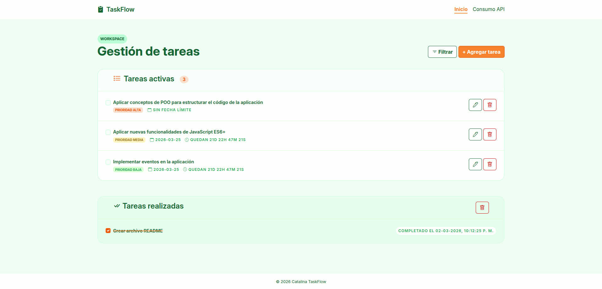
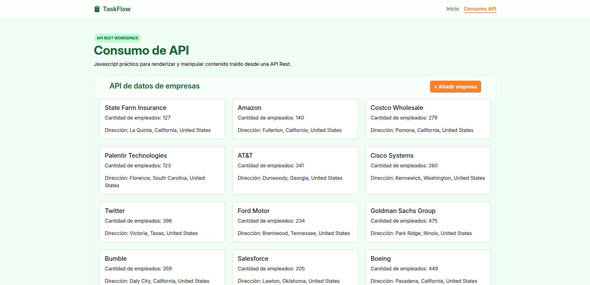
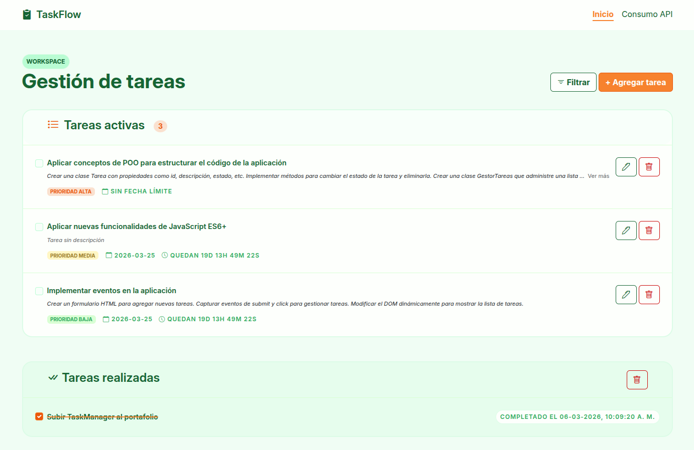

# **Proyecto: TaskFlow**

**Proyecto realizado con JavaScript. Cuenta con dos funcionalidades:**

- La primera funcionalidad consiste en un gestor de tareas. El objetivo es aplicar todos los aprendizajes de Javascript, incluyendo la programación orientada a objetos (POO).
- La segunda funcionalidad consiste en realizar consultas a una API y utilizar los datos que se obtienen de la consulta.

## Versión 1.0.0

### Funcionalidad: Gestor de tareas

Este gestor cuenta con una variedad de funcionalidades que serán enumeradas a continuación. Para conocer cada función y evento, dirigirse al código y ver el comentario asociado a cada uno.

**1. Cambiar el estado de una tarea.**

- Si la tarea se completa, renderiza en "Tareas realizadas" y muestra la fecha en que se completó.
- Se pueden desmarcar tareas completadas y volverán a aparecer como tareas activas.

**2. Crear tareas.**

- Se puede decidir si la tarea tiene fecha límite (caducidad)
- Se puede decidir la prioridad de la tarea (por defecto: Prioridad baja)

**3. Editar tareas.**

- Se puede editar cualquier tarea a elección, mientras esta no se encuentre completada

**4. Eliminar tareas.**

- Se puede eliminar cualquier tarea a elección, mientras esta no se encuentre completada
- Se pueden eliminar todas las tareas completadas

**5. Calculo de tiempo restante.**

- Se muestra el tiempo restante para completar la tarea (cuenta regresiva) y se actualiza cada un segundo.

### Funcionalidad: Consulta API Rest

Esta página realiza conexión a API personalizada, creada para fines prácticos y de prueba.
Se realizan consultas para solicitar los datos y para agregar datos a través de un formulario.

## Versión 1.1.0

### Gestor de tareas: Mejora de la experiencia del usuario.

- Para mejorar el producto, se selecciono a un grupo de usuarios y se realizó una investigación.
- De dicha investigación, se implementaron las siguientes mejoras:

**1. Nuevo campo de entrada: Titulo.**

- Antes toda la descripción iba junto al checkbox (control que sirve para marcar/desmarcar una tarea como realizada).
- Ahora se añadió un nuevo campo de entrada para "Titulo" y este es el que se muestra junto al checkbox de cada tarea.
- El título sólo puede tener un máximo de 255 caracteres.
- Esto mejora la experiencia al dar la posibilidad al usuario de generar una tarea con una descripción extensa sin que se vea una interfaz saturada de texto.

**2. Descripción larga oculta**

- Se permite al usuario escribir una descripción extensa, pero cuando esta supera los 255 caracteres se trunca el texto y aparece un botón para "ver más".
- Cuando la descripción se expande, aparece un botón para "ver menos" y volver a contraer la información.
- Esto le permite al usuario expandir o contraer el texto según necesidad.

---

## Versión 2.0.0 (próximamente)

Consideraciones para la próxima versión:

- Crear filtro de busqueda y dar la posibilidad al usuario de ordenar las tareas.
- Crear conexión a Calendario y permitir al usuario exportar sus tareas.
