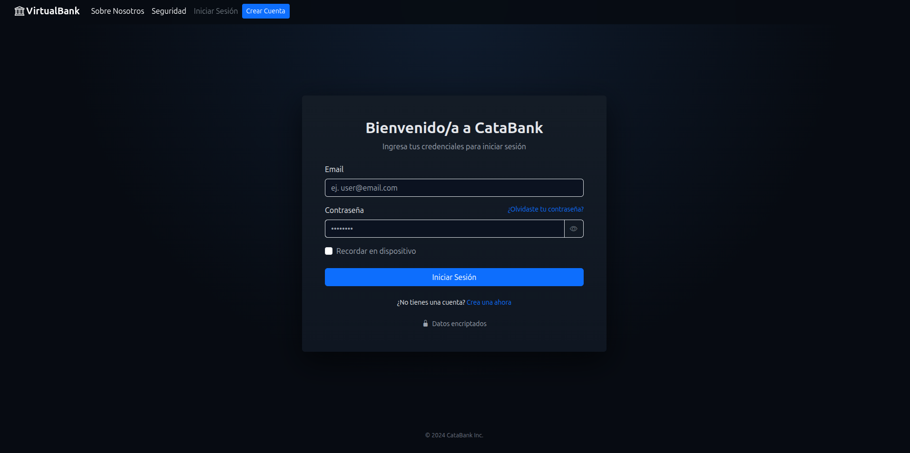
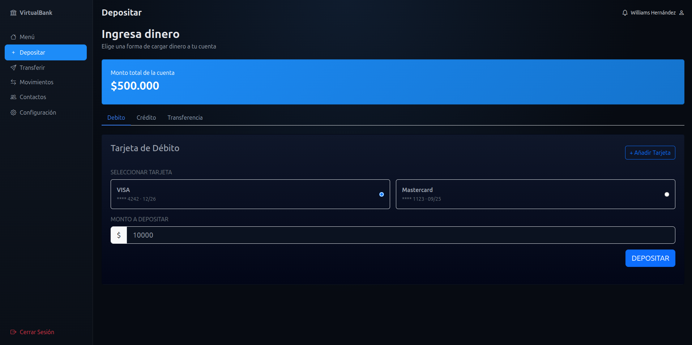
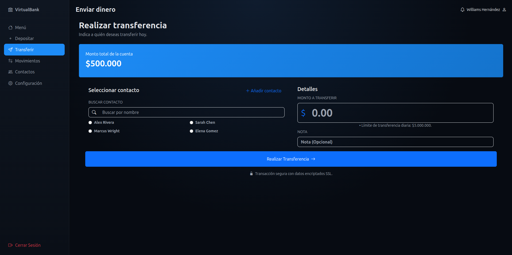
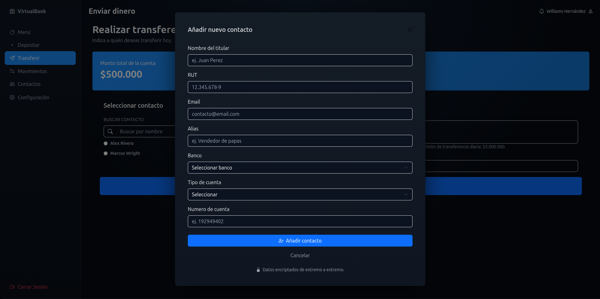
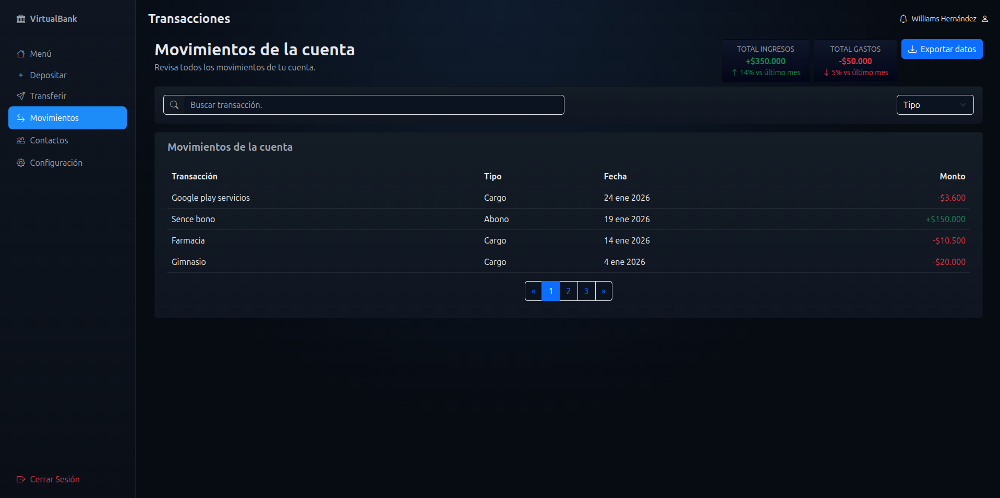
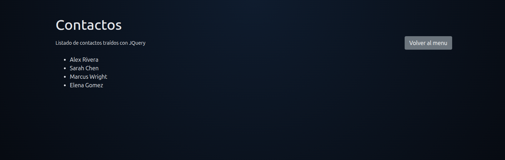

# **Proyecto: VirtualBank**

Proyecto realizado con JavaScript. Simula una aplicación de banco virtual.

## Versión 1 del proyecto (versión actual)

#### index.html

Corresponde a la pantalla de inicio del proyecto. Existe un único botón funcional, el de inicio de sesión.

#### login.html

Corresponde a la pantalla de inicio de sesión o 'Login'. Para efectos prácticos, la validación de inicio de sesión es mediante credenciales estáticas:

- Email: user@email.com
- Password: qwerty

#### menu.html

Corresponde al menú o 'Dashboard' que ve el usuario una vez iniciada sesión.
Dentro de esta pantalla tenemos un menú principal ubicado en el lateral izquierdo.
Contamos con un resumen financiero que se actualiza en tiempo real (saldo de la cuenta) y además un resumen de los últimos 6 movimientos de la cuenta.

#### deposit.html

En esta página podemos cargar dinero a nuestra cuenta.
Visualmente tenemos 3 métodos para agregar dinero: Vía tarjeta de débito, vía tarjeta de crédito y vía transferencia.

- Para efectos prácticos vamos a utilizar una de las tarjetas de débito previamente guardadas e ingresaremos un monto mayor a 0 para poder cargar a la tarjeta.

#### sendmoney.html

En esta página contamos con 2 funcionalidades:

- Funcionalidad principal: Transferir dinero
  Para transferir dinero debemos elegir un contacto al cual vamos a enviar dinero. Podemos usar el buscador o directamente elegir uno.
  Luego ingresamos un monto a transferir mayor que 0 e inferior al dinero que tengo actualmente en mi cuenta.
  
- Funcionalidad secundaria: Añadir contacto
  Podemos agregar un nuevo contacto. Se nos va a desplegar un formulario que debemos completar. Los datos no están estrictamente validados pero se espera que en futuras actualizaciones se verifique la autenticidad de los datos.
  

#### transactions.html

En esta página podemos ver los movimientos realizados por la cuenta. Contamos con un filtro para tipo de movimiento.
Veremos movimientos precargados y en medida que hagamos movimientos propios se irán sumando sin ningún problema.

#### contacts.html

Esta página es una construcción trabajada con Bootstrpa 4 y JQuery. Para efectos puramente prácticos.
Se realizan dos funcionalidades con jQuery, siendo la primera el render de un listado de contactos y la segunda un botón para retornar al menú principal.
