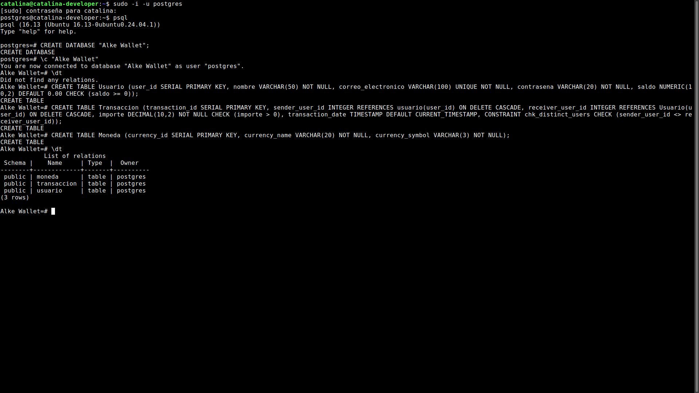
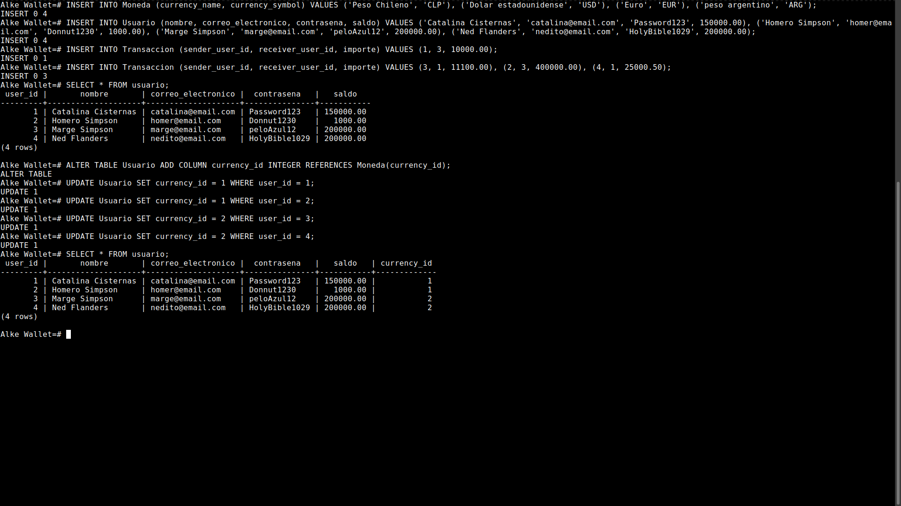
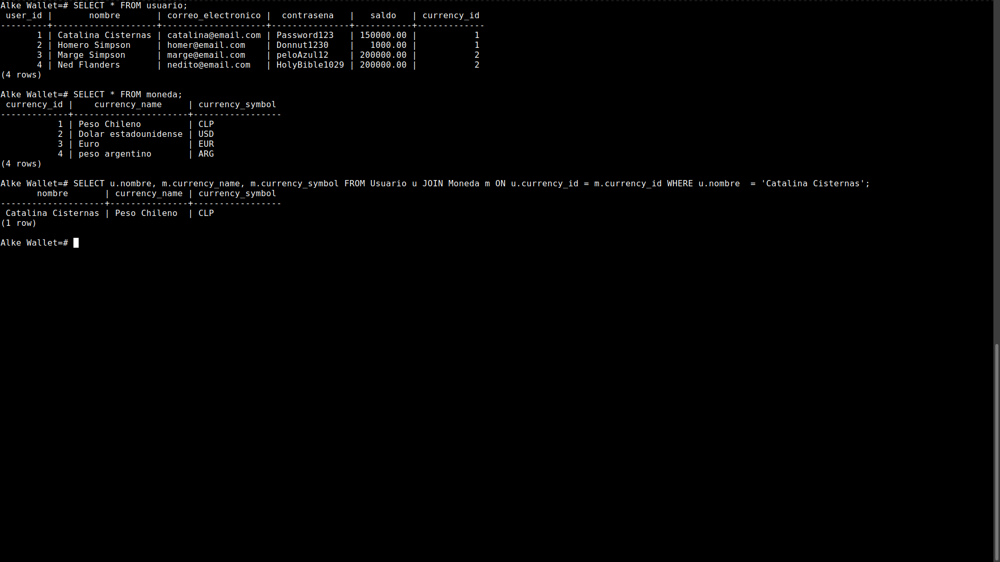
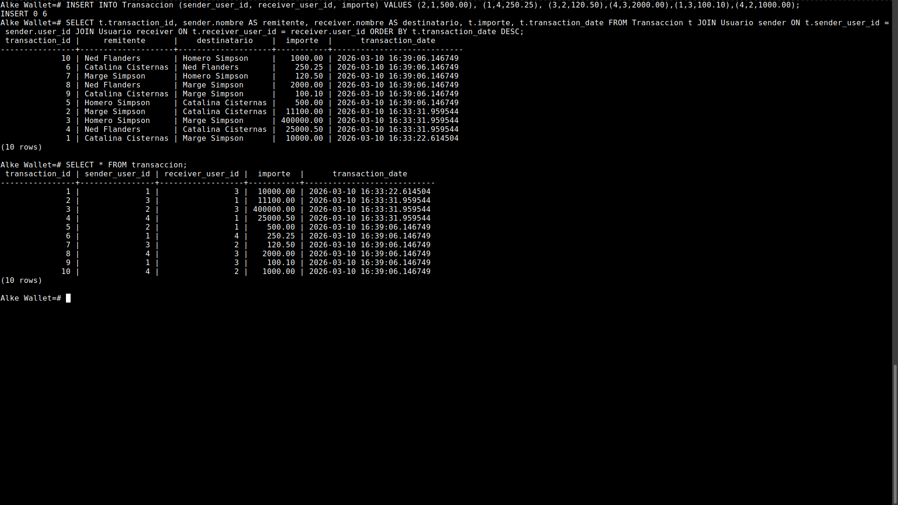
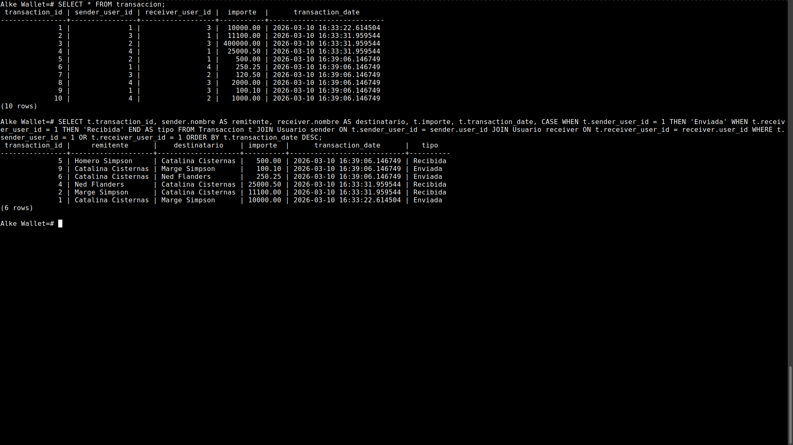
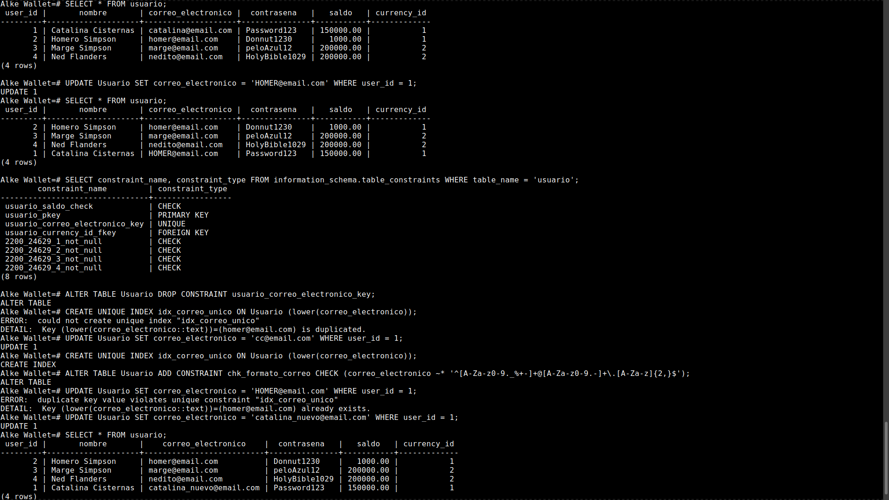
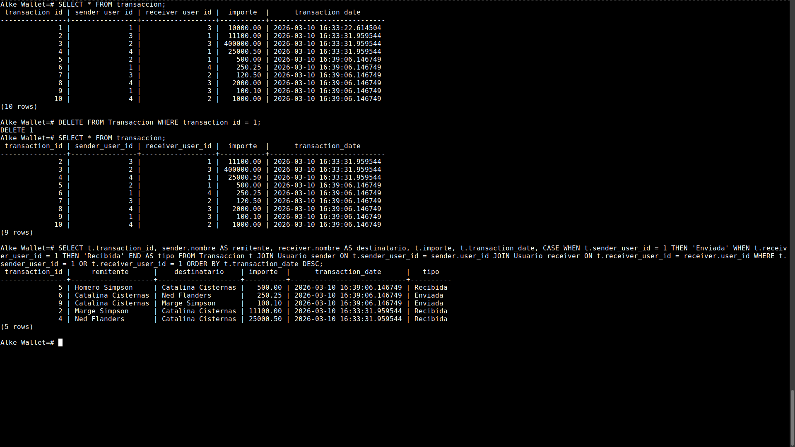
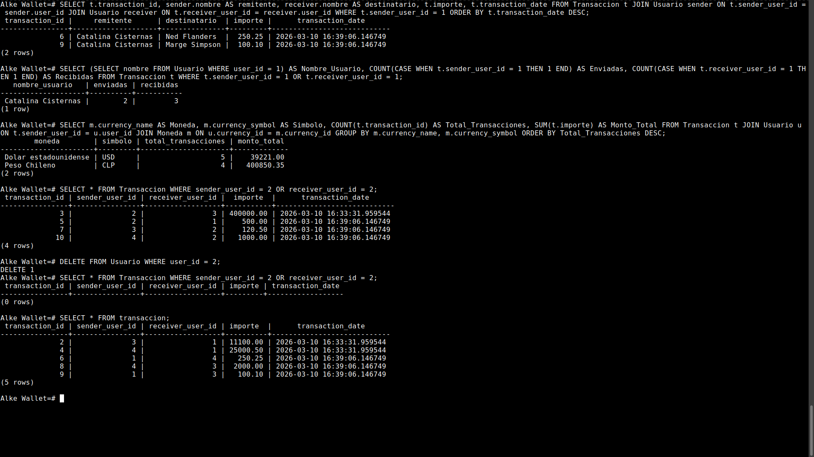
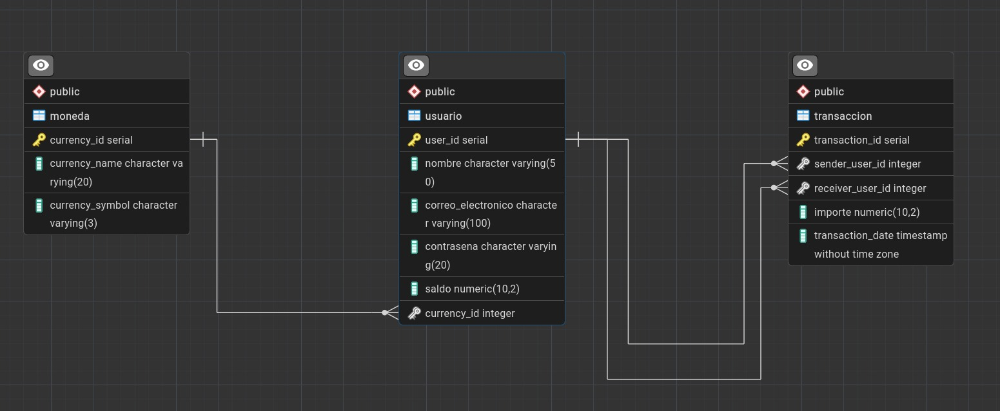

# **BASE DE DATOS CREADA EN POSTGRESQL**

En el archivo **_database.sql_** se encuentran los comandos y query utilizados para crear la base de datos del proyecto. Este ejercicio lo he realizado en mi entorno de desarrollo con Linux Mint mediante el uso de la terminal.

## Crear base de datos

#### Se crea la base de datos, se accede a ella y se añaden las tablas.

#### Se agregan datos a las tablas y se modifica tabla de usuario para relacionarla con la de moneda.

## Consultas evaluación SQL

#### 1) Consulta de la consigna de evaluación: Obtener el nombre de la moneda elegida por un usuario.

- El usuario elegido, se ha seleccionado por nombre.
- Se muestran las tablas que interactúan en la consulta.

#### 2) Consulta de la consigna de evaluación: Obtener todas las transacciones registradas.

- Se añaden transacciones para completar un mínimo de 10.
- Se consultan las transacciones, mostrando los usuarios que enviaron y recibieron dinero.
- Se ordenan por fecha.
- Más abajo se muestra la tabla original de transacciones.

#### 3) Consulta de la consigna de evaluación: Obtener todas las transacciones de un usuario en específico.

- Se muestran todas las transacciones (10 en total)
- Luego se muestran sólo las transacciones donde el usuario 1 (user_id = 1) se ve involucrado, ya sea enviado dinero o recibiendo dinero.

#### 4) Consulta de la consigna de evaluación: Modificar campo correo_electronico de un usuario en específico.

- Se muestran usuarios
- Se cambia email de uno de los usuario, replicando valor de otro, pero en mayúsculas.
- Se altera tabla para evitar duplicados independiente de que el correo esté en mayúscula o minúscula.
- Se corrobora que funciona.
- Se cambia correo electrónico de usuario 1 y se maneja el error de duplicados.

#### 5) Consulta de la consigna de evaluación: Eliminar datos de una transacción (fila completa)

- Se elimina una transacción completa.
- Se corrobora mostrando las transacciones del usuario 1. Antes eran 6, ahora son 5.

## Consultas adicionales SQL

#### Realicé algunas consultas que se salen de la consigna pero me parecen relevantes para poner en práctica lo aprendido.

- Obtener todas las transacciones realizadas por un usuario (usuario 1). Se filtran sólo las transacciones donde usuario 1 envía dinero. Se dejan fuera las transacciones donde recibe dinero.
- Obtener la cantidad total de transacciones realizadas en la cuenta del usuario 1.
- Cuantificar cuántas transacciones se realizaron por tipo de moneda
- Eliminar al usuario 2. Primero verifico las transacciones donde este usuario existe. Luego lo elimino y vuelvo a verificar las transacciones.

## ERD for table

